$\color{#FF69B4}{ 1}$

# 概述

算法是程序的灵魂，优秀的程序可以在海量数据计算时，依然保持高速计算;

一般来讲 程序会使用了内存计算框架(比如Spark)和缓存技术(比如Redis等)来优化程序,再深入的思考一下，这些计算框架和缓存技术， 它的核心功能是哪个部分呢？

拿实际工作经历来说, 在Unix下开发服务器程序，功能是要支持上千万人同时在线， 在上线前，做内测，一切OK,可上线后，服务器就支撑不住了, 公司的CTO对代码进行优化，再次上线，坚如磐石。你就能感受到程序是有灵魂的，就是算法。

**数据结构和算法的关系**

- 数据data结构(structure)是一门研究组织**数据**方式的学科，有了编程语言也就有了数据结构.学好数据结构可以编写出更加漂亮,更加有效率的代码。
- 要学习好数据结构就要多多考虑如何将生活中遇到的问题,用程序去实现解决.
- 程序 = **数据结构** + 算法
- 数据结构是算法的基础, 换言之，想要学好算法，需要把数据结构学到位。

**数据结构包括：线性结构和非线性结构。**

$\color{#FF69B9}{线性结构}$

1. 线性结构作为最常用的数据结构，其特点是**数据元素之间存在一对一的线性关系**
2. 线性结构有两种不同的存储结构，即**顺序存储结构（数组）**和**链式存储结构（链表）**。
3. 顺序存储的线性表称为顺序表，**顺序表中的存储元素是连续的**。
4. 链式存储的线性表称为链表，**链表中的存储元素不一定是连续**的，元素节点中存放数据元素以及相邻元素的地址信息
5. 线性结构常见的有：**数组、队列、链表和栈**，后面我们会详细讲解.


$\color{#FF69B9}{非线性结构}$

非线性结构包括：**二维数组，多维数组，广义表，树结构，图结构**

# 数据结构

## 1、稀疏数组


分析问题: 

因为该二维数组的很多值是默认值0, 因此记录了很多没有意义的数据.

**基本介绍**

当一个数组中大部分元素为０，或者为同一个值的数组时，可以使用稀疏数组来保存该数组。

稀疏数组的处理方法是:

1. 第一行记录数组一共有几行几列，有多少个不同的值；
2. 把具有不同值的元素的行列及值记录在一个小规模的数组中，从而缩小程序的规模；


**实例：**


二维数组 转 稀疏数组的思路：

1. 遍历原始的二维数组，得到有效数据的个数 sum
2. 根据sum 就可以创建 稀疏数组 sparseArr   int[sum + 1] [3]
3. 将二维数组的有效数据数据存入到稀疏数组


稀疏数组转原始的二维数组的思路：

1. 先读取稀疏数组的第一行，根据第一行的数据，创建原始的二维数组，比如上面的  chessArr2 = int [11][11]
2. 在读取稀疏数组后几行的数据，并赋给 原始的二维数组 即可.

**代码实现：**SparseArray.java

## 2、队列

队列介绍

- 队列是一个有序列表，可以用**数组**或是**链表**来实现。
- 遵循**先入先出**的原则。即：先存入队列的数据，要先取出。后存入的要后取出。

### **1. 数组模拟队列**

- 队列本身是有序列表，若使用数组的结构来存储队列的数据，则队列数组的声明如下图, 其中 **maxSize** 是该队列的最大容量。

- 因为队列的输出、输入是分别从前后端来处理，因此需要两个变量 **front**及 **rear**分别记录队列前后端的下标，front 会随着数据输出而改变，而 rear则是随着数据输入而改变，如图所示:

- **核心细节**就是，对于一个数的队列，front和rear该怎么去指，这两个值相等就代表空，要么front指向当前队头数下标，rear指向后一个下标；要么front指向前一个下标，rear指向当前数下标。老师这里的最后一个图有问题的。


 当我们将数据存入队列时称为”**addQueue**”，addQueue 的处理需要有两个步骤：

1. 将尾指针往后移：rear+1 , 当front == rear 【空】
2. 若尾指针 rear 小于队列的最大下标 maxSize-1，则将数据存入 rear所指的数组元素中，否则无法存入数据。 rear  == maxSize - 1 [队列满]

**代码实现：**ArrayQueueDemo.java

问题分析并优化

1. 目前数组使用一次就不能用，没有达到复用的效果
2. 将这个数组使用算法，改进成一个环形的队列取模:  **%**

### 2. 数组模拟环形队列


**详细说明：**

**====>>>>队列为空：**

​	front指向当前队头数下标，rear指向队尾数后一个下标；初始值均为0；

​	因为为0开始，所以是先存数据，后移下标，先拿数据，后移下标。这里写法是预留一个空位置做约定，这个位置是空的，即只能存maxSize-1个数。

​	条件：front= =rear；

**====>>>>当前front、rear的下一个指向位置：**

​	front：正常情况下，下一个下标就是front+1，但是我们在到达最后一个索引时，要回到0位置，所以我们需要对M取模才行。即：（front+1）% M；

​	rear：即（rear+1）% M；

**====>>>>队列满：**

​	最简单的思路：

​			当前rear的下一个下标，等于当前front的下标指向，即满了。

​			条件：（rear+1）% M = front

​	其他思路：

​			因为为0开始，所以是先存数据，后移下标，先拿数据，后移下标。这里写法是预留一个空位置做约定，这个位置是空的，即只能存maxSize-1个数。

​			1. 只存未取：当rear存完arr[M-2]后，rear=M-1，此时就判断满了，虽然我们实际情况下没有存M个数，但还是假装存了M个，只是有一个位置我们存的是空的预留空间。所以条件为：`rear-front+1=M`。（通过数组下标获取中间存放数据数量哦）

​			2. 存了取了：分两段判断，front—M-1 区间的长度：M-1-front+1；0—rear的区间：rear-0+1。加起来条件就是：M-front+rear+1=M；即条件：`rear+1=front`。其中这里直接想都可以知道，不用算。

​			满足这两个条件任意一个即为存满了。

**====>>>>队列中有效数据长度：**

​	前面说了我们只能存M-1个数，所以有效数据最多为M-1。

​	思路：rear-front +1 -1表示这两个下标之间存的数据个数，当rear>front的时候，这个值为正，就是实际的有效数据个数，当rear<front的时候，值为负，表示数组里面有几个位置没有存值，这里也包括了哪个预留的位置。

## 3、链表

链表是有序的列表——链式表，但是它在内存中是存储如下：


小结:

1. 链表是以节点的方式来存储,是**链式存储**
2. 每个节点包含 data 域， next 域：指向下一个节点.
3. 如图：发现链表的各个节点不一定是连续存储.
4. 链表分**带头节点**的链表和**没有头节点**的链表，根据实际的需求来确定

### 1. 单链表


==注意注意》》》》：==

查询修改的时候： temp以后都取第一个数据点，统一一下写法！！，正因为如此，每次第一步是：判断链表是否为空，否则取不到第一个数据点。

添加的时候：temp只能取head。因为他没数据的嘛。

==《《《《注意注意：==

单链表 **(带头结点)** 逻辑结构示意图如下：头节点不存放任何信息，而且千万不能乱动，头节点变化的话，这个链表就找不到了。

链表尾节点的标志：next域为null。


**应用实例：**

使用带head头的单向链表实现 –水浒英雄排行榜管理；

- 完成对英雄人物的增删改查操作。
- 第一种方法在添加英雄时，直接添加到链表的尾部。
- 第二种方式在添加英雄时，根据排名将英雄插入到指定位置 (如果有这个排名，则添加失败，并给出提示)

**第一种方法添加：**


部分代码：


```java

//添加节点到单向链表
//思路，当不考虑编号顺序时
//1. 找到当前链表的最后节点
//2. 将最后这个节点的next 指向 新的节点
public void add(HeroNode heroNode) {

   //因为head节点不能动，因此我们需要一个辅助遍历 temp
   HeroNode temp = head;
   //遍历链表，找到最后
   while(true) {
      //找到链表的最后
      if(temp.next == null) {//
         break;
      }
      //如果没有找到最后, 将将temp后移
      temp = temp.next;
   }
   //当退出while循环时，temp就指向了链表的最后
   //将最后这个节点的next 指向 新的节点
   temp.next = heroNode;
}

//显示链表[遍历]
	public void list() {
		//判断链表是否为空
		if(head.next == null) {
			System.out.println("链表为空");
			return;
		}
		//因为头节点，不能动，因此我们需要一个辅助变量来遍历
		HeroNode temp = head.next;
		while(true) {
			//输出节点的信息
			System.out.println(temp);
			//判断是否到链表最后
			if (temp.next==null){
				break;
			}
			//将temp后移， 一定小心
			temp = temp.next;
		}
	}
```

**第二种方法添加：**


这里很细节哦：首先我们插入的时候，肯定是插入temp和temp.next的中间位置对吧，所以我们判断的时候，只能根据temp.next和新节点比较，因为temp只能获取下一个节点的信息，不能获取上一个节点！！！，插入替换操作需要，对应三个节点的信息！！！。

部分代码：

```java
//第二种方式在添加英雄时，根据排名将英雄插入到指定位置
//(如果有这个排名，则添加失败，并给出提示)
public void addByOrder(HeroNode heroNode) {
   //因为头节点不能动，因此我们仍然通过一个辅助指针(变量)来帮助找到添加的位置
   //因为单链表，因为我们找的temp 是位于 添加位置的前一个节点，否则插入不了
   HeroNode temp = head;
   boolean flag = false; // flag标志添加的编号是否存在，默认为false
   while(true) {
      if(temp.next == null) {//说明temp已经在链表的最后
         break; //
      }
      if(temp.next.no > heroNode.no) { //位置找到，就在temp的后面插入
         break;
      } else if (temp.next.no == heroNode.no) {//说明希望添加的heroNode的编号已然存在

         flag = true; //说明编号存在
         break;
      }
      temp = temp.next; //后移，遍历当前链表
   }
   //判断flag 的值
   if(flag) { //不能添加，说明编号存在
      System.out.printf("准备插入的英雄的编号 %d 已经存在了, 不能加入\n", heroNode.no);
   } else {
      //插入到链表中, temp的后面
      heroNode.next = temp.next;
      temp.next = heroNode;
   }
}
```

**修改节点信息：**

根据编号no进行每个数据的唯一标识，拿着这个找到对应的节点。

```java
//修改节点的信息, 根据no编号来修改，即no编号不能改.
//说明
//1. 根据 newHeroNode 的 no 来修改即可
public void update(HeroNode newHeroNode) {
   //判断是否空
   if(head.next == null) {
      System.out.println("链表为空~");
      return;
   }
   //找到需要修改的节点, 根据no编号
   //定义一个辅助变量
   HeroNode temp = head.next;
   boolean flag = false; //表示是否找到该节点
   while(true) {
      if(temp.no == newHeroNode.no) {
         //找到
         flag = true;
         break;
      }
      if (temp.next == null) {
         break; //已经遍历完链表
      }
      temp = temp.next;
   }
   //根据flag 判断是否找到要修改的节点
   if(flag) {
      temp.name = newHeroNode.name;
      temp.nickname = newHeroNode.nickname;
   } else { //没有找到
      System.out.printf("没有找到 编号 %d 的节点，不能修改\n", newHeroNode.no);
   }
}
```

**删除节点**

根据节点的no进行删除


```java
//删除节点
//思路
//1. head 不能动，因此我们需要一个temp辅助节点找到待删除节点的前一个节点
//2. 说明我们在比较时，是temp.next.no 和  需要删除的节点的no比较
public void del(int no) {
   HeroNode temp = head;
   boolean flag = false; // 标志是否找到待删除节点的
   while(true) {
      if(temp.next == null) { //已经到链表的最后
         break;
      }
      if(temp.next.no == no) {
         //找到的待删除节点的前一个节点temp
         flag = true;
         break;
      }
      temp = temp.next; //temp后移，遍历
   }
   //判断flag
   if(flag) { //找到
      //可以删除
      temp.next = temp.next.next;
   }else {
      System.out.printf("要删除的 %d 节点不存在\n", no);
   }
}
```

##### 题目

**// 1、查找单链表中的倒数第k个结点 【新浪面试题】**

```java

//思路
//1. 编写一个方法，接收head节点，同时接收一个index
//2. index 表示是倒数第index个节点
//3. 先把链表从头到尾遍历，得到链表的总的长度 getLength
//4. 得到size 后，我们从链表第一个数据点开始遍历 (size-index)个，就可以得到
//5. 如果找到了，则返回该节点，否则返回null
public static HeroNode findLastIndexNode(HeroNode head, int index) {
   //判断如果链表为空，返回null
   if(head.next == null) {
      return null;//没有找到
   }
   //第一个遍历得到链表的长度(节点个数)
   int size = getLength(head);
   //第二次遍历  size-index 位置，就是我们倒数的第K个节点
   //先做一个index的校验
   if(index <=0 || index > size) {
      return null;
   }
   //定义给辅助变量， for 循环定位到倒数的index
   HeroNode cur = head.next; //从第一个数据点开始
   for(int i =0; i< size - index; i++) {
      cur = cur.next;
   }
   return cur;
}
```

**// 2、单链表的翻转**


思路如下：


```java
	//将单链表反转
	public static void reversetList(HeroNode head) {
		//如果当前链表为空，或者只有一个节点，无需反转，直接返回
		if(head.next == null || head.next.next == null) {
			return ;
		}

		//定义一个辅助的指针(变量)，帮助我们遍历原来的链表
		HeroNode temp = head.next;
		HeroNode next = null;// 指向当前节点[temp]的下一个节点
		HeroNode reverseHead = new HeroNode(0, "", "");
		//遍历原来的链表，每遍历一个节点，就将其取出，并放在新的链表reverseHead 的最前端
		//动脑筋
		while(true) {
			next = temp.next;//先暂时保存当前节点的下一个节点，因为后面需要使用
			temp.next = reverseHead.next;//将temp的下一个节点指向新的链表的最前端
			reverseHead.next = temp; //将temp 连接到新的链表上
			if (next==null){
				break;
			}
			temp = next;//让temp后移
		}
		//将head.next 指向 reverseHead.next , 实现单链表的反转
		head.next = reverseHead.next;
	}
```

**// 3、从尾到头打印单链表**


```java
//可以利用栈这个数据结构，将各个节点压入到栈中，然后利用栈的先进后出的特点，就实现了逆序打印的效果
public static void reversePrint(HeroNode head) {
   //空链表，不能打印
   if(head.next == null) {
      return;
   }
   //创建要给一个栈，将各个节点压入栈
   Stack<HeroNode> stack = new Stack<>();
   HeroNode temp = head.next;
   //将链表的所有节点压入栈
   while(true) {
      stack.push(temp);
      if (temp.next==null){//如果为最后一个节点，则break，不再后移
         break;
      }
      temp = temp.next; //temp后移，这样就可以压入下一个节点
   }
   //将栈中的节点进行打印,pop 出栈
   while (stack.size() > 0) {
      System.out.println(stack.pop()); //stack的特点是先进后出
   }
}
```

### 2. 双链表

就是比单向链表多了一个属性，多一个pre域，指向前一个节点。


还是用前面的水浒传英雄的例子：

新建对象，加了一个pre对象。

```java
//定义HeroNode2 ， 每个HeroNode 对象就是一个节点
class HeroNode2 {
    public int no;
    public String name;
    public String nickname;
    public HeroNode2 next; //指向下一个节点
    public HeroNode2 pre;
		..............
}
```

**添加节点：**

```java
//添加节点到双向链表
    //思路，当不考虑编号顺序时
    //1. 找到当前链表的最后节点
    //2. 将最后这个节点的next 指向 新的节点，新节点的pre指向这个节点
    public void add(HeroNode2 heroNode2) {

        //因为head节点不能动，因此我们需要一个辅助遍历 temp
        HeroNode2 temp = head;
        //遍历链表，找到最后
        while(true) {
            //找到链表的最后
            if(temp.next == null) {//
                break;
            }
            //如果没有找到最后, 将将temp后移
            temp = temp.next;
        }
        //当退出while循环时，temp就指向了链表的最后
        temp.next = heroNode2;
        heroNode2.pre = temp;
    }
```

**删除节点：**

```java
//删除节点
    //思路：因为是双向的，所以我们直接找到这个被删除节点即可；
    public void del(int no) {
        if (head.next==null){
            return;
        }
        HeroNode2 temp = head.next;
        boolean flag = false; // 标志是否找到待删除节点的
        while(true) {
            if(temp.no == no) {
                //找到的待删除节点的前一个节点temp
                flag = true;
                break;
            }
            if(temp.next == null) { //已经到链表的最后
                break;
            }
            temp = temp.next; //temp后移，遍历
        }
        //判断flag
        if(flag) {
            temp.pre.next = temp.next;
            if (temp.next!=null){
                //这里有问题，当被删除的为最后一个节点时，出现空指针异常；所以必须先判断是不是最后一个
                temp.next.pre = temp.pre;
            }
        }else {
            System.out.printf("要删除的 %d 节点不存在\n", no);
        }
    }
```

**修改节点：**

```java
//修改节点的信息, 根据no编号来修改，即no编号不能改.
    //根据 newHeroNode 的 no 来修改即可
    public void update(HeroNode2 newHeroNode) {
        //判断是否空
        if(head.next == null) {
            System.out.println("链表为空~");
            return;
        }
        //找到需要修改的节点, 根据no编号
        //定义一个辅助变量
        HeroNode2 temp = head.next;
        boolean flag = false; //表示是否找到该节点
        while(true) {
            if(temp.no == newHeroNode.no) {
                //找到
                flag = true;
                break;
            }
            if (temp.next == null) {
                break; //已经遍历完链表
            }
            temp = temp.next;
        }
        //根据flag 判断是否找到要修改的节点
        if(flag) {
            temp.name = newHeroNode.name;
            temp.nickname = newHeroNode.nickname;
        } else { //没有找到
            System.out.printf("没有找到 编号 %d 的节点，不能修改\n", newHeroNode.no);
        }
    }
```

### 3. 单向环形链表

**问题描述：**

Josephu(约瑟夫、约瑟夫环)  问题

设编号为1，2，… n的n个人围坐一圈，约定编号为k（1<=k<=n）的人从1开始报数，数到m 的那个人出列，它的下一位又从1开始报数，数到m的那个人又出列，依次类推，直到所有人出列为止，由此产生一个出队编号的序列。

**思路：**

用一个不带头结点的单向循环链表来处理Josephu 问题：先构成一个有n个结点的单循环链表，然后由k结点起从1开始计数，计到m时，对应结点从链表中删除，然后再从被删除结点的下一个结点又从1开始计数，直到最后一个结点从链表中删除算法结束。

这种就是不带头节点的链表。


**我们简单写一个例子分析：**


具体单向环形链表实现思路：

1、添加第一个节点时，first是固定指向的，类似于头节点不要乱动。必须让第一个节点自己指向自己。


2、添加后续节点时，新建一个辅助指针---curBoy，指向first这里；然后curBoy的next指向新节点boy，新节点boy的next指向first这里；最后curBoy = curBoy.next；；boy不是均是指的要加进来的新节点撒。


3、遍历环形链表

1. 先让一个辅助指针(变量) curBoy，指向first节点
2.  然后通过一个while循环遍历 该环形链表即可 curBoy.next  == first 结束

**代码实现：**


**创建对应的链表：**

```java
//创建环形单向链表
class CircleSingleLinkedList{
  
    // 第一个first节点，当前没有编号
    private Boy first = null;

    //添加小孩节点，构建一个环形的链表, 参数为小孩的个数
    public void addBoy(int nums){
        //数据检验，至少有一个小孩
        if (nums < 1){
            System.out.println("nums的数值错误");
        }
        Boy curBoy = null;  //辅助指针
        // 使用for循环创建环形链表
        for (int i = 1; i <= nums; i++) {
            //根据编号创建小孩节点（从1开始编号）
            Boy boy = new Boy(i);
            //如果是第一个小孩
            if (i==1){
                first = boy;
                first.setNext(first);
                curBoy = first;
            }else {
                // 后续小孩
                curBoy.setNext(boy);
                boy.setNext(first);
                curBoy = curBoy.getNext();
            }
        }
    }

}
```

**遍历：**

```java
//    遍历链表
    public void showBoy(){
        if (first==null){
            System.out.println("链表为空");
            return;
        }
        //因为first不能动，所以需要辅助指针
        Boy temp = first;
        while (true){
            System.out.println("小孩编号为："+temp.getNo());
            if (temp.getNext()==first){
                break;
            }
            temp = temp.getNext();
        }
    }
```

**出圈的顺序：**


写在`class CircleSingleLinkedList`内部方法

```java
/**
 * 根据用户的输出，计算出圈的顺序
 * @param startNo  表示从第几个小孩开始数--k
 * @param countNum  表示数几下--m
 * @param nums  表示最初有多少个小孩--n
 */
public void countBoy(int startNo, int countNum, int nums){
    // 数据校验
    if (first==null||startNo<1||startNo>nums){
        System.out.println("数据不合理");
        return;
    }
  
    // 创建辅助指针,让他指向最后一个节点
    Boy hepler = first;
    while (true){
        if (hepler.getNext()==first){
            break;
        }
        hepler = hepler.getNext();
    }
  
    // 小孩报数前，先让 first 和  helper 移动 k - 1次
    for (int j=0;j<startNo-1;j++){
        first = first.getNext();
        hepler = hepler.getNext();
    }
  
    // 当小孩报数时，让first 和 helper 指针同时 的移动m-1 次,然后出圈
    while (true) {
        //只剩下一个小孩时，break；不然陷入死循环
        if (hepler==first){
            break;
        }
        //让first 和 helper 指针同时 的移动m-1 次
        for (int j =0; j<countNum-1;j++){
            first = first.getNext();
            hepler = hepler.getNext();
        }
        // 此时first指向的节点就是要出圈的小孩
        System.out.println("小孩出圈的编号为："+first.getNo());
        first = first.getNext();
        hepler.setNext(first);
    }
    System.out.println("最后留在圈里面的小孩编号为："+first.getNo());
}
```

## 4、栈

**简介：**

1. 栈的英文为(stack)
2. 栈是一个**先入后出** (FILO-First In Last Out) 的**有序列表**。
3. 栈(stack)是限制线性表中元素的插入和删除只能在线性表的同一端进行的一种特殊线性表。允许插入和删除的一端，为变化的一端，称为**栈顶(Top)**，另一端为固定的一端，称为**栈底(Bottom)。**
4. 根据栈的定义可知，最先放入栈中元素在栈底，最后放入的元素在栈顶，而删除元素刚好相反，最后放入的元素最先删除，最先放入的元素最后删除


**栈的应用场景：**

- 子程序的调用：在跳往子程序前，会先将下个指令的地址存到堆栈中，直到子程序执行完后再将地址取出，以回到原来的程序中。 	
- 处理递归调用：和子程序的调用类似，只是除了储存下一个指令的地址外，也将参数、区域变量等数据存入堆栈中。
- 表达式的转换 **[中缀表达式转后缀表达式]** 与求值(实际解决)。
- 二叉树的遍历。
- 图形的深度优先(depth一first)搜索法。

### 1. 数组模拟栈

用数组模拟栈的使用，由于栈是一种有序列表，当然可以使用数组的结构来储存栈的数据内容，下面我们就用数组模拟栈的出栈，入栈等操作。


下面两部分代码写在一个java文件里面；

```java
public class ArrayStackDemo {
    public static void main(String[] args) {
        //测试一下ArrayStack 是否正确
        //先创建一个ArrayStack对象->表示栈
        ArrayStack stack = new ArrayStack(4);
        String key = "";
        boolean loop = true; //控制是否退出菜单
        Scanner scanner = new Scanner(System.in);

        while(loop) {
            System.out.println("show: 表示显示栈");
            System.out.println("exit: 退出程序");
            System.out.println("push: 表示添加数据到栈(入栈)");
            System.out.println("pop: 表示从栈取出数据(出栈)");
            System.out.println("请输入你的选择");
            key = scanner.next();
            switch (key) {
                case "show":
                    stack.list();
                    break;
                case "push":
                    System.out.println("请输入一个数");
                    int value = scanner.nextInt();
                    stack.push(value);
                    break;
                case "pop":
                    try {
                        int res = stack.pop();
                        System.out.printf("出栈的数据是 %d\n", res);
                    } catch (Exception e) {
                        // TODO: handle exception
                        System.out.println(e.getMessage());
                    }
                    break;
                case "exit":
                    scanner.close();
                    loop = false;
                    break;
                default:
                    break;
            }
        }

        System.out.println("程序退出~~~");
    }
}
```

```java
// 定义一个ArrayStack，表示栈
class ArrayStack{
    private int maxSize;  // 栈的大小
    private int[] stack; //数组模拟栈，数据放在这个数组
    private int top = -1;  //top——栈顶，初始化-1

    // 构造器
    public ArrayStack(int maxSize) {
        this.maxSize = maxSize;
        stack = new int[maxSize];
    }

//    栈满了
    public boolean isFull(){
        return top==maxSize-1;
    }
//    栈空
    public boolean isEmpty(){
        return top==-1;
    }
//    入栈-push
    public void push(int value){
        // 判断栈满
        if (isFull()){
            System.out.println("栈满");

            return;
        }
        top++;
        stack[top] = value;
    }
//    出栈--pop
    public int pop(){
        if (isEmpty()){
            throw new RuntimeException("栈空");
        }
        int value = stack[top];
        top--;
        return value;
    }
//    遍历栈--从栈顶往下遍历哦，按着出栈的顺序
    public void list(){
        if (isEmpty()){
            System.out.println("栈空");
            return;
        }
        for (int i = top; i>=0;i--){
            System.out.printf("stack[%d] = %d\n",i,stack[i]);
        }
    }
}
```

### 2. 栈实现计算器

思路如下：


这里具体计算的时候，是后出栈的那个数写在运算的前面哦！！！！！


<<<<<<< HEAD
然后这里最难的一个地方就是：如何解决多位数字的情况！！

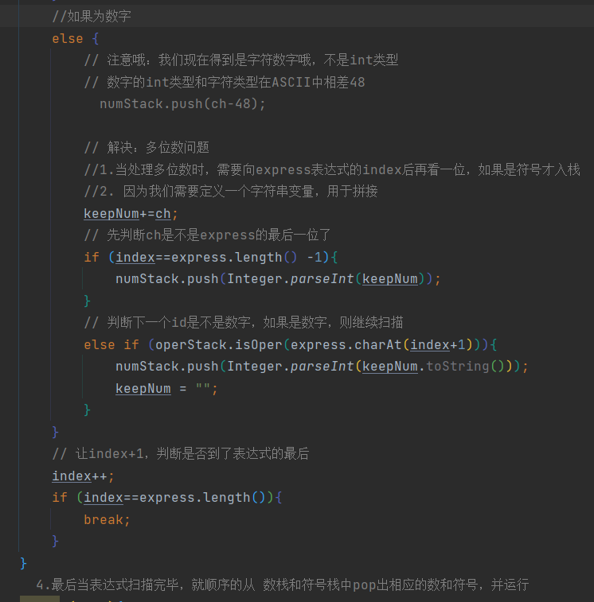

### 3. 前缀、中缀、后缀表达书

**前缀表达式 ——(波兰表达式)**

前缀表达式的运算符位于操作数之前。

举例说明： (3+4)×5-6 对应的前缀表达式就是 - × + 3 4 5 6

从右至左扫描表达式，遇到数字时，将数字压入堆栈，遇到运算符时，弹出栈顶的两个数，用运算符对它们做相应的计算（栈顶元素 和 次顶元素），并将结果入栈；重复上述过程直到表达式最左端，最后运算得出的值即为表达式的结果。

例如: (3+4)×5-6 对应的前缀表达式就是 - × + 3 4 5 6 , 针对前缀表达式求值步骤如下:

1. 从右至左扫描，将6、5、4、3压入堆栈
2. 遇到+运算符，因此弹出3和4（3为栈顶元素，4为次顶元素），计算出3+4的值，得7，再将7入栈
3. 接下来是×运算符，因此弹出7和5，计算出7×5=35，将35入栈
4. 最后是 - 运算符，计算出35-6的值，即29，由此得出最终结果。

**中缀表达式**

中缀表达式就是常见的运算表达式，如(3+4)×5-6

中缀表达式的求值是我们人最熟悉的，但是对计算机来说却不好操作(前面我们讲的案例就能看的这个问题)，因此，在计算结果时，往往会将中缀表达式转成其它表达式来操作(一般转成后缀表达式.)

**后缀表达式（计算机主要用这个）**

后缀表达式又称逆波兰表达式,与前缀表达式相似，只是运算符位于操作数之后

举例说明： (3+4)×5-6 对应的后缀表达式就是 3 4 + 5 × 6 –

从左至右扫描表达式，遇到数字时，将数字压入堆栈，遇到运算符时，弹出栈顶的两个数，用运算符对它们做相应的计算（次顶元素 和 栈顶元素），并将结果入栈；重复上述过程直到表达式最右端，最后运算得出的值即为表达式的结果

例如: (3+4)×5-6 对应的后缀表达式就是 3 4 + 5 × 6 - , 针对后缀表达式求值步骤如下:

1. 从左至右扫描，将3和4压入堆栈；
2. 遇到+运算符，因此弹出4和3（4为栈顶元素，3为次顶元素），计算出3+4的值，得7，再将7入栈；
3. 将5入栈；
4. 接下来是×运算符，因此弹出5和7，计算出7×5=35，将35入栈；
5. 将6入栈；
6. 最后是-运算符，计算出35-6的值，即29，由此得出最终结果

### 4、逆波兰计算器

**实现要求：**

- 输入一个逆波兰表达式( 后缀表达式 )，使用栈(Stack), 计算其结果;
- 支持小括号和多位数整数，因为这里我们主要讲的是数据结构，因此计算器进行简化，只支持对整数的计算。

思路就是前面写的那样，其中用到了正则表达式取出多位数的数字，使用一个List存储后缀表达式的每一个字符，而且这里做了一定的简化，就是按照每个数字、运算符空格隔开了！！！，这样我们就可以很轻松的获得每一个数字和运算符，不用考虑多位数的问题。

```java
public class PolandNotation {
    public static void main(String[] args) {
        //先定义给逆波兰表达式
        //(30+4)×5-6  => 30 4 + 5 × 6 - => 164
        //说明为了方便，逆波兰表达式 的数字和符号使用空格隔开
        String suffixExpression = "30 4 + 5 * 6 -";
        //思路
        //1. 先将 "3 4 + 5 × 6 - " => 放到ArrayList中
        //2. 将 ArrayList 传递给一个方法，遍历 ArrayList 配合栈 完成计算

        List<String> list = getListString(suffixExpression);
        System.out.println("rpnList=" + list);

        int res = calculate(list);
        System.out.println("计算的结果是=" + res);
    }
  
//    方法1.将一个波兰表达书，依次将数据和运算符放入到ArrayList里面
    public static List<String> getListString(String suffixExpression){
        // 将suffixExpression分割
        String[] split = suffixExpression.split(" ");
        List<String> list = new ArrayList<>();
        for (String ele : split) {
            list.add(ele);
        }
        return list;
    }
    //完成对逆波兰表达式的运算
// /*
//  * 1)从左至右扫描，将3和4压入堆栈；
//    2)遇到+运算符，因此弹出4和3（4为栈顶元素，3为次顶元素），计算出3+4的值，得7，再将7入栈；
//    3)将5入栈；
//    4)接下来是×运算符，因此弹出5和7，计算出7×5=35，将35入栈；
//    5)将6入栈；
//    6)最后是-运算符，计算出35-6的值，即29，由此得出最终结果
//  */

    public static int calculate(List<String> list){
        // 创建栈
        Stack<String> stack = new Stack<>();
        for (String item : list) {
            //使用正则表达式取出数字
            if (item.matches("\\d+")){
                stack.push(item);
            }
            else {
                // 如果为运算符
                int num1 = Integer.parseInt(stack.pop());
                int num2 = Integer.parseInt(stack.pop());
                int res = 0;
                switch (item){
                    case "+":
                        res = num2 + num1;
                        break;
                    case "-":
                        res = num2 - num1;
                        break;
                    case "*":
                        res = num2 * num1;
                        break;
                    case "/":
                        res = num2 / num1;
                        break;
                    default:
                        throw new RuntimeException("运算符有误");
                }
                stack.push(String.valueOf(res));
            }
        }
        // 最后留在stack就是运算结果
        return Integer.parseInt(stack.pop());

    }
}
```

### 5、**中缀表达式转换为后缀**

大家看到，后缀表达式适合计算式进行运算，但是人却不太容易写出来，尤其是表达式很长的情况下，因此在开发中，我们需要将 中缀表达式转成后缀表达式。

**具体步骤如下:**

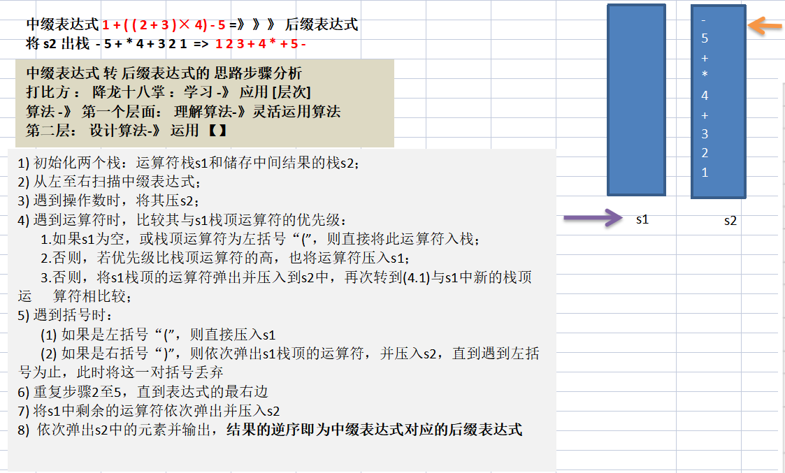

这里我们中缀表达式就是正常的运算表达式了，如1+((2+3)×4)-5，很连贯的式子，没有用什么空格分开，所以第一个问题就是如何将多位数、运算符单独拿出来，放到List集合里面，方便我们使用，这个前面在 ”栈实现计算器“ 写过，基本一样的思路。

- // ASCII码  数字0-9对应的48—57

**1. 将中缀表达式 转换成对应的List，方便我们遍历**

```java
//1. 将中缀表达式 转换成对应的List，方便我们遍历

//    "1+((2+3)×4)-5" => ArrayList [1,+,(,(,2,+,3,),*,4,),-,5]
    public static List<String> toInfixExpressionList(String express){
        List<String> list = new ArrayList<>();
        int index = 0; //字符串索引，
        String str = ""; // 多位数的拼接
        char c; // 扫描到的每一个字符
        while (index < express.length()){
            c = express.charAt(index);
            //1. c为非数字,直接加到List里面
            // ASCII码 数字0-9对应的48—57
            if (c<48 || c>57){
                list.add(c+"");
                index++;
            }
            else {
                //2. c为数字
                str += c;  //先拼上数字,后面必须都用这个str进行操作才行
                // 先判断是不是到了表达式的最后一位，假如最后一位，直接加到list
                if (index==express.length()-1){
                    list.add(str);
                    index++;
                }else {

                // 不是表达式的最后一位，往后再判断下一位，是不是运算符，
                    // 是运算符，则直接当前位加到list，
                    // 不是运算符，则把当前位的字符拼接到str;
                    if (express.charAt(index+1)<48||express.charAt(index+1)>57){
                        list.add(str);
                        index++;
                        str = "";
                    }else {
                        index++;
                    }
                }
            }
        }
        return list;
    }
```

**2.将中缀表达式的list转为后缀表达式的list**

```java
// 2.将中缀表达式的list转为后缀表达式的list
//    即 ArrayList [1,+,(,(,2,+,3,),*,4,),-,5]  =》 ArrayList [1,2,3,+,4,*,+,5,–]
    public static List<String> parseSuffixExpressionList(List<String> list){
        // 定义两个栈
        Stack<String> s1 = new Stack<>();  //符号栈
//        Stack<String> s2 = new Stack<>();  //存储中间结果的栈
        //说明：因为s2 这个栈，在整个转换过程中，没有pop操作，而且后面我们还需要逆序输出
        //因此比较麻烦，这里我们就不用 Stack<String> 直接使用 List<String> s2
        List<String> s2 = new ArrayList<>();

        // 遍历list
        for (String item : list) {
            //1. 如果为数字，则入s2
            if (item.matches("\\d+")){
                s2.add(item);
            }else if (item.equals("(")){
            // 2. 括号情况
                s1.push(item);
            }else if (item.equals(")")){
                //如果是右括号“)”，则依次弹出s1栈顶的运算符，并压入s2，直到遇到左括号为止，此时将这一对括号丢弃
                while (!s1.peek().equals("(")){
                    s2.add(s1.pop());
                }
                s1.pop(); //弹出 （ ，消除小括号
            }else {
            // 3. 运算符情况
                // 当item的优先级小于等于栈顶运算符，将s1栈顶的运算符弹出并压入到s2中，再次转到(4.1)与s1中新的栈顶运算符相比较
                // 这里在下面写了一个比较运算符优先级高低的方法_Operation.getValue()
                while (s1.size()!= 0 && Operation.getValue(item)<=Operation.getValue(s1.peek())){
                    s2.add(s1.pop());
                }
                // 上面的循环结束时，要么空栈了，要么运算符比栈顶的级别高，则把item入栈
                s1.push(item);
            }
        }
        // 将s1中剩余的运算符依次弹出并压入s2
        while (s1.size()!=0){
            s2.add(s1.pop());
        }
        return s2;
    }

}

// 编写一个类，可以返回一个运算符对应的优先级数字（自定义）
class Operation {
    private static int ADD = 1;
    private static int SUB = 1;
    private static int MUL = 2;
    private static int DIV = 2;

    // 返回对应的运算符的优先级数字
    public static int getValue(String operation){
        int res = 0;  //非运算符设为0，优先级最低
        switch (operation){
            case "+":
                res = ADD;
                break;
            case "-":
                res = SUB;
                break;
            case "*":
                res = MUL;
                break;
            case "/":
                res = DIV;
                break;
            default:
                break;
        }
        return res;
    }

}
```

## 5、递归回溯

简单的说: 递归就是方法自己调用自己,每次调用时传入不同的变量.递归有助于编程者解决复杂的问题,同时可以让代码变得简洁。

首先我们先理解递归方法在java内存内部的调用：

最左边的区域是：栈空间。

1、压栈到递归的末尾


2、再一个个进行出栈


```
递归调用规则：
1. 当程序执行到一个方法时，就会开辟一个独立的空间(栈)
2. 每个空间的数据(局部变量)，是独立的.
```

**递归用于解决什么样的问题**

- 各种数学问题如: 8皇后问题 , 汉诺塔, 阶乘问题, 迷宫问题, 球和篮子的问题(google编程大赛)
- 各种算法中也会使用到递归，比如快排，归并排序，二分查找，分治算法等.
- 将用栈解决的问题-->递归代码比较简洁

**递归需要遵守的重要规则**

1. 执行一个方法时，就创建一个新的受保护的独立空间(栈空间)
2. 方法的局部变量是独立的，不会相互影响, 比如n变量
3. 如果方法中使用的是引用类型变量(比如数组)，就会共享该引用类型的数据.
4. 递归必须向退出递归的条件逼近，否则就是无限递归,出现StackOverflowError，死龟了:)
5. 当一个方法执行完毕，或者遇到return，就会返回，遵守谁调用，就将结果返回给谁，同时当方法执行完毕或者返回时，该方法也就执行完毕。

### 1.迷宫问题

红色的方格为墙，不能走，这里我们设定问题为：小球从8x7的地图出发位置为  [1] [1] 目标位置为；最右下角[6] [5]


说明: 

- 小球得到的路径，和程序员设置的找路策略有关即：找路的上下左右的顺序相关
- 再得到小球路径时，可以先使用(下右上左)，再改成(上右下左)，看看路径是不是有变化
- 测试回溯现象
- 思考: 如何求出最短路径?   

对于最短路径的情况，我们这里只能改变每次的找路策略，然后记录看看哪种策略的路径最短，暂时没有其他办法。

```java


public class MiGong {
    public static void main(String[] args) {
        // 先创建一个二维数组，模拟迷宫
        // 地图
        int[][] map = new int[8][7];
        // 使用1 表示墙
        // 上下全部置为1
        for (int i = 0; i < 7; i++) {
            map[0][i] = 1;
            map[7][i] = 1;
        }

        // 左右全部置为1
        for (int i = 0; i < 8; i++) {
            map[i][0] = 1;
            map[i][6] = 1;
        }
        //设置挡板, 1 表示
        map[3][1] = 1;
        map[3][2] = 1;

        // 输出地图
        System.out.println("地图的情况");
        for (int i = 0; i < 8; i++) {
            for (int j = 0; j < 7; j++) {
                System.out.print(map[i][j] + " ");
            }
            System.out.println();
        }
        // 使用递归回溯给小球找路
        setWay(map,1,1);

        //输出新的地图，是小球走过的并且标识过的地图
        System.out.println("输出新的地图，是小球走过的并且标识过的地图");
        for (int i = 0; i < 8; i++) {
            for (int j = 0; j < 7; j++) {
                System.out.print(map[i][j] + " ");
            }
            System.out.println();
        }
    }

    // 使用递归回溯来给小球找路
    // 1.map表示地图
    // 2.i，j表示地图上的小球出发位置
    // 3. 如果小球可以到map[6][5]，则说明路径找到了
    // 4. 约定，当map[i][j]，为0，表示该点没有走过，为1表示墙，为2表示通路可以走，为3表示该点走过，但是不通
    //5. 走迷宫的时候，需要指定一个策略：例如下->右->上->左 , 如果该点走不通，再回溯
    public static boolean setWay(int[][] map, int i, int j){
        if (map[6][5]==2){  //通路已经找到
            return true;
        }else {
            if (map[i][j]==0){  //如果当前这个点还没有走过
                // 按照策略 下->右->上->左 进行移动
                map[i][j] = 2; //假设该点可以走通
                if (setWay(map, i+1, j)){ //向下走
                    return true;
                }else if (setWay(map,i,j+1)){ //向右走
                    return true;
                }else if (setWay(map,i-1,j)){ //向上
                    return true;
                }else if (setWay(map, i, j-1)){  //向左
                    return true;
                }else {
                    // 说明该点是走不通的，是死路
                    map[i][j] = 3;
                    return false;
                }
            }else {  // 如果map[i][j] != 0,可能是1，2，3
                return false;
            }
        }
    }
   // 小球的寻址路径为：上右下左
    public static boolean setWay2(int[][] map, int i, int j){
        if (map[6][5]==2){  //通路已经找到
            return true;
        }else {
            if (map[i][j]==0){  //如果当前这个点还没有走过
                // 按照策略 下->右->上->左 进行移动
                map[i][j] = 2; //假设该点可以走通
                if (setWay(map, i-1, j)){ //向上走
                    return true;
                }else if (setWay(map,i,j+1)){ //向右走
                    return true;
                }else if (setWay(map,i+1,j)){ //向下
                    return true;
                }else if (setWay(map, i, j-1)){  //向左
                    return true;
                }else {
                    // 说明该点是走不通的，是死路
                    map[i][j] = 3;
                    return false;
                }
            }else {  // 如果map[i][j] != 0,可能是1，2，3
                return false;
            }
        }
    }
}
```

### 2.八皇后问题

八皇后问题是一个古老而著名的问题，是回溯算法的典型案例。该问题是国际西洋棋棋手马克斯·贝瑟尔于1848年提出：在8×8格的国际象棋上摆放八个皇后，使其不能互相攻击，即：**任意两个皇后都不能处于同一行、同一列或同一斜线上，问有多少种摆法。**

==八皇后问题算法思路分析==

1. 第一个皇后先放第一行第一列
2. 第二个皇后放在第二行第一列、然后判断是否OK， 如果不OK，继续放在第二列、第三列、依次把所有列都放完，找到一个合适
3. 继续第三个皇后，还是第一列、第二列……直到第8个皇后也能放在一个不冲突的位置，算是找到了一个正确解
4. 当得到一个正确解时，在栈回退到上一个栈时，就会开始回溯，即将第一个皇后，放到第一列的所有正确解，全部得到.
5. 然后回头继续第一个皇后放第二列，后面继续循环执行 1,2,3,4的步骤. 

**说明：**理论上应该创建一个二维数组来表示棋盘，但是实际上可以通过算法，用一个一维数组即可解决问题. arr[8] = {0 , 4, 7, 5, 2, 6, 1, 3}  //对应arr 下标 表示第几行，即第几个皇后，arr[i] = val , val 表示第i+1个皇后，放在第i+1行的第val+1列。

```java
package com.ccooky.recursion;

public class Queue8 {

    //定义一个max表示共有多少个皇后
    int max = 8;
    //定义数组array，保存皇后放置的位置比如 arr = {0 , 4, 7, 5, 2, 6, 1, 3}
    int[] array = new int[max];
    static int count = 0;
    public static void main(String[] args) {
        // 测试一下，8皇后是否ok
        Queue8 queue8 = new Queue8();
        queue8.check(0);
        System.out.printf("一共有%d解法", count);

    }
    // 编写一个方法，放置第n个皇后
    // 特别注意：check时每一次递归时，进入到check中都有 for (int i = 0; i<max; i++)，因此会有回溯！
    private void check(int n){
        if (n==max){
            // 8个皇后就已经放好了
            print();
            return;
        }
        else {
            // 依次放入皇后，判断是否冲突
            for (int i = 0; i<max; i++){
                // 先把这个皇后n，放到该行的第一列
                array[n] = i;
                // 判断当把这个n皇后，放到第i列时，是否会冲突
                if (judge(n)){
                    // 当这个n皇后不冲突时
                    // 接着放第n+1个皇后，即开始递归了
                    check(n+1);
                }
                // 如果冲突的话，就会继续执行array[n] = i;即将第n个皇后放置到本行的下一个位置
            }
        }
    }

    // 查看当我们放置第n个皇后时，就去检测该皇后是否和前面已经摆放的皇后冲突了
    private boolean judge(int n){
        for (int i = 0; i < n; i++) {
            // 说明
            //1. array[i] ==array[n] 表示判断第n个皇后是否和前面的n-1个皇后在同一列
            //2. Math.abs(n-i) == Math.abs(array[n]-array[i]) 表示第n个皇后和第i个皇后是否在同一个斜线
            if (array[i] == array[n] || Math.abs(n-i) == Math.abs(array[n]-array[i]) ) {
                return false;
            }
        }
        return true;
    }

    // 写一个方法，可以将皇后摆放的位置输出
    private void print(){
        count++;
        for (int i : array) {
            System.out.print(i );
        }
        System.out.println();
    }
}
```

# 算法的时间复杂度

**度量一个程序(算法)执行时间的两种方法**

1、事后统计的方法

这种方法可行, 但是有两个问题：一是要想对设计的算法的运行性能进行评测，需要实际运行该程序；二是所得时间的统计量依赖于计算机的硬件、软件等环境因素, 这种方式，要在同一台计算机的相同状态下运行，才能比较那个算法速度更快。

2、事前估算的方法

通过分析某个算法的时间复杂度来判断哪个算法更优.

**时间频度**

一个算法花费的时间与算法中语句的执行次数成正比例，哪个算法中语句执行次数多，它花费时间就多。`一个算法中的语句执行次数称为语句频度或时间频度。记为T(n)。`

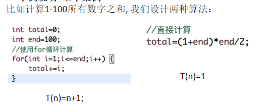

**时间复杂度**

一般情况下，算法中的基本操作语句的重复执行次数是问题规模n的某个函数，用T(n)表示，若有某个辅助函数f(n)，使得当n趋近于无穷大时，T(n) / f(n) 的极限值为不等于零的常数，则称**f(n)是T(n)的同数量级函数**。记作 T(n)=Ｏ( f(n) )，称**Ｏ( f(n) )**  为算法的渐进时间复杂度，简称时间复杂度。

T(n) 不同，但时间复杂度可能相同。 如：T(n)=n²+7n+6 与 T(n)=3n²+2n+2 它们的T(n) 不同，但时间复杂度相同，都为O(n²)。

常见时间复杂度：

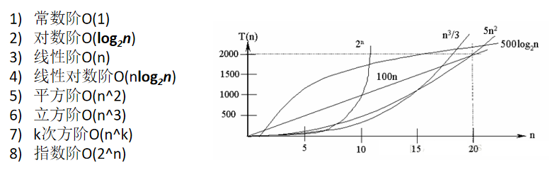

常见的算法时间复杂度由小到大依次为：

`Ο(1)＜Ο(log2n)＜Ο(n)＜Ο(nlog2n)＜Ο(n2)＜Ο(n3)＜ Ο(nk) ＜Ο(2n)` ，随着问题规模n的不断增大，上述时间复杂度不断增大，算法的执行效率越低

## 1、常数阶O(1)

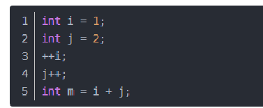

无论代码执行了多少行，只要是没有循环等复杂结构，那这个代码的时间复杂度就都是O(1)；

上述代码在执行的时候，它消耗的时候并不随着某个变量的增长而增长，那么无论这类代码有多长，即使有几万几十万行，都可以用O(1)来表示它的时间复杂度。

## 2、对数阶O(log2n)

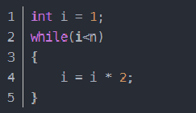

说明：在while循环里面，每次都将 i 乘以 2，乘完之后，i 距离 n 就越来越近了。假设循环x次之后，i 就大于 2 了，此时这个循环就退出了，也就是说 2 的 x 次方等于 n，那么 `x = log2n`也就是说当循环 `log2n` 次以后，这个代码就结束了。因此这个代码的时间复杂度为：O(log2n)  。 O(log2n) 的这个2 时间上是根据代码变化的，i = i * 3 ，则是 `O(log3n) .`

## 3、线性阶O(n)

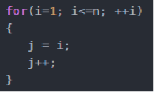

说明：这段代码，for循环里面的代码会执行n遍，因此它消耗的时间是随着n的变化而变化的，因此这类代码都可以用O(n)来表示它的时间复杂度‘


## 4、线性对数阶O(nlogN)


说明：线性对数阶O(nlogN) 其实非常容易理解，将时间复杂度为O(logn)的代码循环N遍的话，那么它的时间复杂度就是 n * O(logN)，也就是了`O(nlogN)`

## 5、平方阶O(n²)

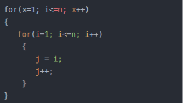

说明：平方阶O(n²) 就更容易理解了，如果把 O(n) 的代码再嵌套循环一遍，它的时间复杂度就是 O(n²)，这段代码其实就是嵌套了2层n循环，它的时间复杂度就是 `O(n*n)`，即  O(n²) 如果将其中一层循环的n改成m，那它的时间复杂度就变成了 `O(m*n)`

## 6、立方阶O(n³)、K次方阶O(n^k)

## 7、平均时间复杂度、最坏时间复杂度

1. 平均时间复杂度是指所有可能的输入实例均以等概率出现的情况下，该算法的运行时间。
2. 最坏情况下的时间复杂度称最坏时间复杂度。一般讨论的时间复杂度均是最坏情况下的时间复杂度。

平均时间复杂度和最坏时间复杂度是否一致，和算法有关(如图:)。

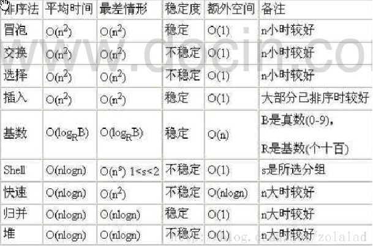

# 空间复杂度

一个算法的空间复杂度(Space Complexity)定义为该算法所耗费的存储空间，它也是问题规模n的函数。

空间复杂度(Space Complexity)是对一个算法在运行过程中临时占用存储空间大小的量度。有的算法需要占用的临时工作单元数与解决问题的规模n有关，它随着n的增大而增大，当n较大时，将占用较多的存储单元，例如快速排序和归并排序算法就属于这种情况

在做算法分析时，**主要讨论的是时间复杂度**。从用户使用体验上看，更看重的程序执行的速度。一些缓存产品(redis, memcache)和算法( 基数排序 )本质就是用空间换时间.

# 排序算法

排序也称排序算法(Sort Algorithm)，排序是将一组数据，依指定的顺序进行排列的过程。

**排序的分类：**

1) 内部排序:

  	指将需要处理的所有数据都加载到内部存储器中进行排序。
2) 外部排序法：
      数据量过大，无法全部加载到内存中，需要借助外部存储进行排序。

**常见的排序算法分类(见右图):**

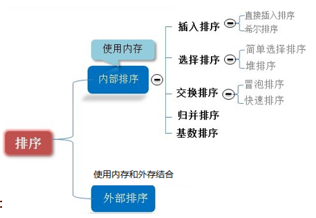

## 1、交换排序

### 1. 冒泡排序

基本思想是：通过对待排序序列**从前向后（从下标较小的元素开始）**,依次比较相邻元素的值，若发现**逆序则交换**，使值**较大的元素逐渐从前移向后部**，就象水底下的气泡一样逐渐向上冒。

PS：`因为排序的过程中，各元素不断接近自己的位置，如果一趟比较下来没有进行过交换，就说明序列有序，因此要在排序过程中设置一个标志flag判断元素是否进行过交换。从而减少不必要的比较。(这里说的优化，可以在冒泡排序写好后，在进行)`

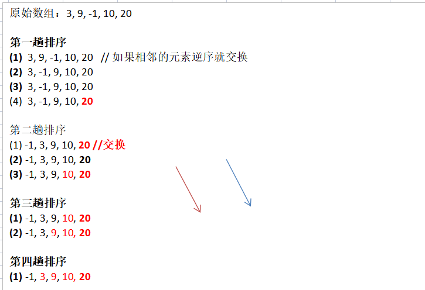

小结冒泡排序规则

(1) 一共进行 **数组的大小-1 次** 大的循环

(2)每一趟排序的次数在逐渐的减少

(3) 如果我们发现在某趟排序中，没有发生一次交换， 可以**提前结束冒泡排序**。这个就是优化


### 2. 快速排序

## 2、选择排序

### 1. 简单选择排序

### 2. 堆排序

## 3、插入排序

### 1. 直接插入排序

### 2. 希尔排序


