$\color{#FF69B4}{ 1}$

# 概述

算法是程序的灵魂，优秀的程序可以在海量数据计算时，依然保持高速计算;

一般来讲 程序会使用了内存计算框架(比如Spark)和缓存技术(比如Redis等)来优化程序,再深入的思考一下，这些计算框架和缓存技术， 它的核心功能是哪个部分呢？

拿实际工作经历来说, 在Unix下开发服务器程序，功能是要支持上千万人同时在线， 在上线前，做内测，一切OK,可上线后，服务器就支撑不住了, 公司的CTO对代码进行优化，再次上线，坚如磐石。你就能感受到程序是有灵魂的，就是算法。

**数据结构和算法的关系**

- 数据data结构(structure)是一门研究组织**数据**方式的学科，有了编程语言也就有了数据结构.学好数据结构可以编写出更加漂亮,更加有效率的代码。
- 要学习好数据结构就要多多考虑如何将生活中遇到的问题,用程序去实现解决.
- 程序 = **数据结构** + 算法
- 数据结构是算法的基础, 换言之，想要学好算法，需要把数据结构学到位。

**数据结构包括：线性结构和非线性结构。**

$\color{#FF69B9}{线性结构}$

1. 线性结构作为最常用的数据结构，其特点是**数据元素之间存在一对一的线性关系**
2. 线性结构有两种不同的存储结构，即**顺序存储结构（数组）**和**链式存储结构（链表）**。
3. 顺序存储的线性表称为顺序表，**顺序表中的存储元素是连续的**。
4. 链式存储的线性表称为链表，**链表中的存储元素不一定是连续**的，元素节点中存放数据元素以及相邻元素的地址信息
5. 线性结构常见的有：**数组、队列、链表和栈**，后面我们会详细讲解.


$\color{#FF69B9}{非线性结构}$

非线性结构包括：**二维数组，多维数组，广义表，树结构，图结构**

# 数据结构

## 1、稀疏数组

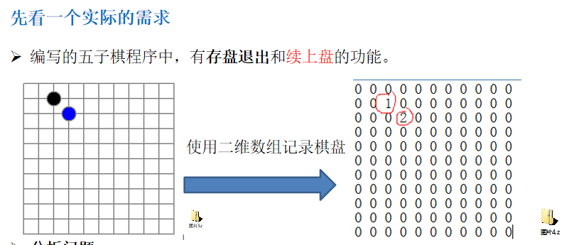

分析问题: 

因为该二维数组的很多值是默认值0, 因此记录了很多没有意义的数据.

**基本介绍**

当一个数组中大部分元素为０，或者为同一个值的数组时，可以使用稀疏数组来保存该数组。

稀疏数组的处理方法是:

1. 第一行记录数组一共有几行几列，有多少个不同的值；
2. 把具有不同值的元素的行列及值记录在一个小规模的数组中，从而缩小程序的规模；

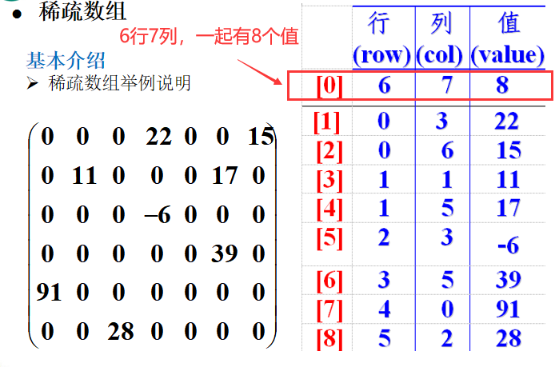

**实例：**

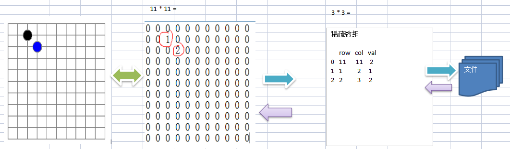

二维数组 转 稀疏数组的思路：

1. 遍历原始的二维数组，得到有效数据的个数 sum
2. 根据sum 就可以创建 稀疏数组 sparseArr   int[sum + 1] [3]
3. 将二维数组的有效数据数据存入到稀疏数组


稀疏数组转原始的二维数组的思路：

1. 先读取稀疏数组的第一行，根据第一行的数据，创建原始的二维数组，比如上面的  chessArr2 = int [11][11]
2. 在读取稀疏数组后几行的数据，并赋给 原始的二维数组 即可.

**代码实现：**SparseArray.java

## 2、队列

队列介绍

- 队列是一个有序列表，可以用**数组**或是**链表**来实现。
- 遵循**先入先出**的原则。即：先存入队列的数据，要先取出。后存入的要后取出。

### **1. 数组模拟队列**

- 队列本身是有序列表，若使用数组的结构来存储队列的数据，则队列数组的声明如下图, 其中 **maxSize** 是该队列的最大容量。

- 因为队列的输出、输入是分别从前后端来处理，因此需要两个变量 **front**及 **rear**分别记录队列前后端的下标，front 会随着数据输出而改变，而 rear则是随着数据输入而改变，如图所示:

- **核心细节**就是，对于一个数的队列，front和rear该怎么去指，这两个值相等就代表空，要么front指向当前队头数下标，rear指向后一个下标；要么front指向前一个下标，rear指向当前数下标。老师这里的最后一个图有问题的。

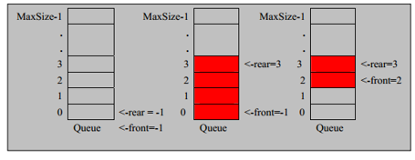

 当我们将数据存入队列时称为”**addQueue**”，addQueue 的处理需要有两个步骤：

1. 将尾指针往后移：rear+1 , 当front == rear 【空】
2. 若尾指针 rear 小于队列的最大下标 maxSize-1，则将数据存入 rear所指的数组元素中，否则无法存入数据。 rear  == maxSize - 1 [队列满]

**代码实现：**ArrayQueueDemo.java

问题分析并优化

1. 目前数组使用一次就不能用，没有达到复用的效果
2. 将这个数组使用算法，改进成一个环形的队列取模:  **%**

### 2. 数组模拟环形队列

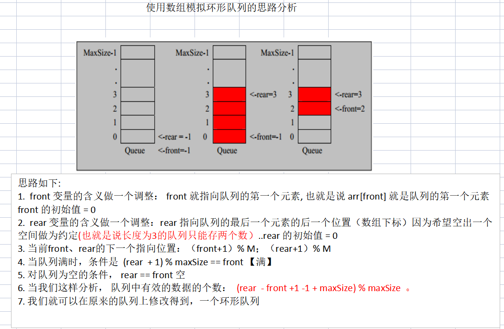

**详细说明：**

**====>>>>队列为空：**

​	front指向当前队头数下标，rear指向队尾数后一个下标；初始值均为0；

​	因为为0开始，所以是先存数据，后移下标，先拿数据，后移下标。这里写法是预留一个空位置做约定，这个位置是空的，即只能存maxSize-1个数。

​	条件：front= =rear；

**====>>>>当前front、rear的下一个指向位置：**

​	front：正常情况下，下一个下标就是front+1，但是我们在到达最后一个索引时，要回到0位置，所以我们需要对M取模才行。即：（front+1）% M；

​	rear：即（rear+1）% M；

**====>>>>队列满：**

​	最简单的思路：

​			当前rear的下一个下标，等于当前front的下标指向，即满了。

​			条件：（rear+1）% M = front

​	其他思路：

​			因为为0开始，所以是先存数据，后移下标，先拿数据，后移下标。这里写法是预留一个空位置做约定，这个位置是空的，即只能存maxSize-1个数。

​			1. 只存未取：当rear存完arr[M-2]后，rear=M-1，此时就判断满了，虽然我们实际情况下没有存M个数，但还是假装存了M个，只是有一个位置我们存的是空的预留空间。所以条件为：`rear-front+1=M`。（通过数组下标获取中间存放数据数量哦）

​			2. 存了取了：分两段判断，front—M-1 区间的长度：M-1-front+1；0—rear的区间：rear-0+1。加起来条件就是：M-front+rear+1=M；即条件：`rear+1=front`。其中这里直接想都可以知道，不用算。

​			满足这两个条件任意一个即为存满了。

**====>>>>队列中有效数据长度：**

​	前面说了我们只能存M-1个数，所以有效数据最多为M-1。

​	思路：rear-front +1 -1表示这两个下标之间存的数据个数，当rear>front的时候，这个值为正，就是实际的有效数据个数，当rear<front的时候，值为负，表示数组里面有几个位置没有存值，这里也包括了哪个预留的位置。

## 3、链表

链表是有序的列表——链式表，但是它在内存中是存储如下：

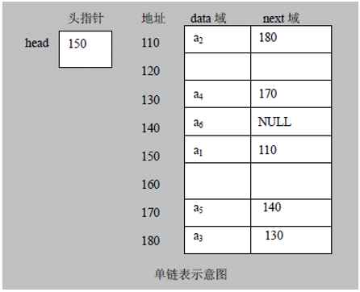

小结:

1. 链表是以节点的方式来存储,是**链式存储**
2. 每个节点包含 data 域， next 域：指向下一个节点.
3. 如图：发现链表的各个节点不一定是连续存储.
4. 链表分**带头节点**的链表和**没有头节点**的链表，根据实际的需求来确定

### 1. 单链表

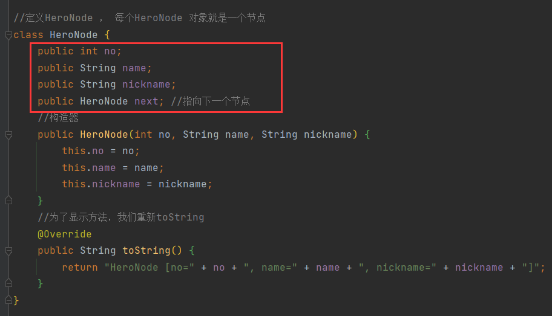

==注意注意》》》》：==

查询修改的时候： temp以后都取第一个数据点，统一一下写法！！，正因为如此，每次第一步是：判断链表是否为空，否则取不到第一个数据点。

添加的时候：temp只能取head。因为他没数据的嘛。

==《《《《注意注意：==

单链表 **(带头结点)** 逻辑结构示意图如下：头节点不存放任何信息，而且千万不能乱动，头节点变化的话，这个链表就找不到了。

链表尾节点的标志：next域为null。

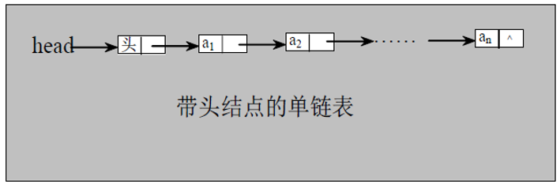

**应用实例：**

使用带head头的单向链表实现 –水浒英雄排行榜管理；

- 完成对英雄人物的增删改查操作。
- 第一种方法在添加英雄时，直接添加到链表的尾部。
- 第二种方式在添加英雄时，根据排名将英雄插入到指定位置 (如果有这个排名，则添加失败，并给出提示)

**第一种方法添加：**

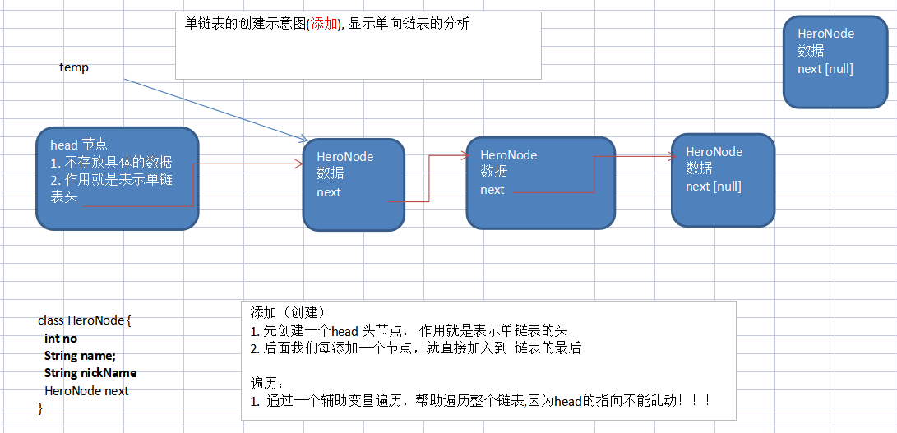

部分代码：

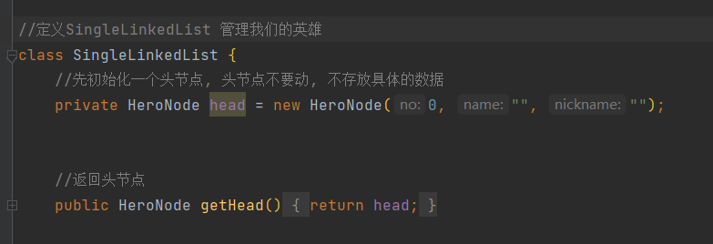

```java

//添加节点到单向链表
//思路，当不考虑编号顺序时
//1. 找到当前链表的最后节点
//2. 将最后这个节点的next 指向 新的节点
public void add(HeroNode heroNode) {

   //因为head节点不能动，因此我们需要一个辅助遍历 temp
   HeroNode temp = head;
   //遍历链表，找到最后
   while(true) {
      //找到链表的最后
      if(temp.next == null) {//
         break;
      }
      //如果没有找到最后, 将将temp后移
      temp = temp.next;
   }
   //当退出while循环时，temp就指向了链表的最后
   //将最后这个节点的next 指向 新的节点
   temp.next = heroNode;
}

//显示链表[遍历]
	public void list() {
		//判断链表是否为空
		if(head.next == null) {
			System.out.println("链表为空");
			return;
		}
		//因为头节点，不能动，因此我们需要一个辅助变量来遍历
		HeroNode temp = head.next;
		while(true) {
			//输出节点的信息
			System.out.println(temp);
			//判断是否到链表最后
			if (temp.next==null){
				break;
			}
			//将temp后移， 一定小心
			temp = temp.next;
		}
	}
```

**第二种方法添加：**

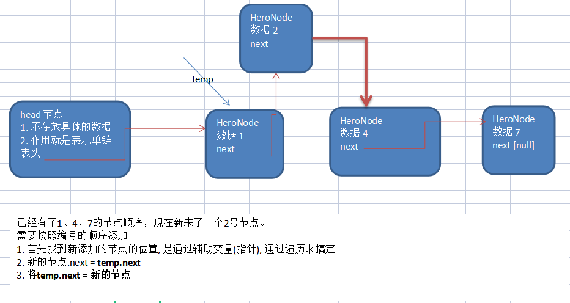

这里很细节哦：首先我们插入的时候，肯定是插入temp和temp.next的中间位置对吧，所以我们判断的时候，只能根据temp.next和新节点比较，因为temp只能获取下一个节点的信息，不能获取上一个节点！！！，插入替换操作需要，对应三个节点的信息！！！。

部分代码：

```java
//第二种方式在添加英雄时，根据排名将英雄插入到指定位置
//(如果有这个排名，则添加失败，并给出提示)
public void addByOrder(HeroNode heroNode) {
   //因为头节点不能动，因此我们仍然通过一个辅助指针(变量)来帮助找到添加的位置
   //因为单链表，因为我们找的temp 是位于 添加位置的前一个节点，否则插入不了
   HeroNode temp = head;
   boolean flag = false; // flag标志添加的编号是否存在，默认为false
   while(true) {
      if(temp.next == null) {//说明temp已经在链表的最后
         break; //
      }
      if(temp.next.no > heroNode.no) { //位置找到，就在temp的后面插入
         break;
      } else if (temp.next.no == heroNode.no) {//说明希望添加的heroNode的编号已然存在

         flag = true; //说明编号存在
         break;
      }
      temp = temp.next; //后移，遍历当前链表
   }
   //判断flag 的值
   if(flag) { //不能添加，说明编号存在
      System.out.printf("准备插入的英雄的编号 %d 已经存在了, 不能加入\n", heroNode.no);
   } else {
      //插入到链表中, temp的后面
      heroNode.next = temp.next;
      temp.next = heroNode;
   }
}
```

**修改节点信息：**

根据编号no进行每个数据的唯一标识，拿着这个找到对应的节点。

```java
//修改节点的信息, 根据no编号来修改，即no编号不能改.
//说明
//1. 根据 newHeroNode 的 no 来修改即可
public void update(HeroNode newHeroNode) {
   //判断是否空
   if(head.next == null) {
      System.out.println("链表为空~");
      return;
   }
   //找到需要修改的节点, 根据no编号
   //定义一个辅助变量
   HeroNode temp = head.next;
   boolean flag = false; //表示是否找到该节点
   while(true) {
      if(temp.no == newHeroNode.no) {
         //找到
         flag = true;
         break;
      }
      if (temp.next == null) {
         break; //已经遍历完链表
      }
      temp = temp.next;
   }
   //根据flag 判断是否找到要修改的节点
   if(flag) {
      temp.name = newHeroNode.name;
      temp.nickname = newHeroNode.nickname;
   } else { //没有找到
      System.out.printf("没有找到 编号 %d 的节点，不能修改\n", newHeroNode.no);
   }
}
```

**删除节点**

根据节点的no进行删除

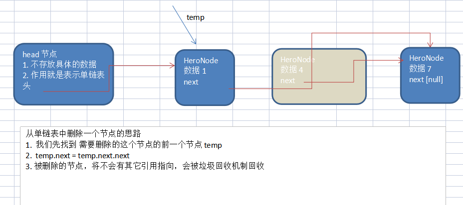

```java
//删除节点
//思路
//1. head 不能动，因此我们需要一个temp辅助节点找到待删除节点的前一个节点
//2. 说明我们在比较时，是temp.next.no 和  需要删除的节点的no比较
public void del(int no) {
   HeroNode temp = head;
   boolean flag = false; // 标志是否找到待删除节点的
   while(true) {
      if(temp.next == null) { //已经到链表的最后
         break;
      }
      if(temp.next.no == no) {
         //找到的待删除节点的前一个节点temp
         flag = true;
         break;
      }
      temp = temp.next; //temp后移，遍历
   }
   //判断flag
   if(flag) { //找到
      //可以删除
      temp.next = temp.next.next;
   }else {
      System.out.printf("要删除的 %d 节点不存在\n", no);
   }
}
```

##### 题目

**// 1、查找单链表中的倒数第k个结点 【新浪面试题】**

```java

//思路
//1. 编写一个方法，接收head节点，同时接收一个index
//2. index 表示是倒数第index个节点
//3. 先把链表从头到尾遍历，得到链表的总的长度 getLength
//4. 得到size 后，我们从链表第一个数据点开始遍历 (size-index)个，就可以得到
//5. 如果找到了，则返回该节点，否则返回null
public static HeroNode findLastIndexNode(HeroNode head, int index) {
   //判断如果链表为空，返回null
   if(head.next == null) {
      return null;//没有找到
   }
   //第一个遍历得到链表的长度(节点个数)
   int size = getLength(head);
   //第二次遍历  size-index 位置，就是我们倒数的第K个节点
   //先做一个index的校验
   if(index <=0 || index > size) {
      return null;
   }
   //定义给辅助变量， for 循环定位到倒数的index
   HeroNode cur = head.next; //从第一个数据点开始
   for(int i =0; i< size - index; i++) {
      cur = cur.next;
   }
   return cur;
}
```

**// 2、单链表的翻转**

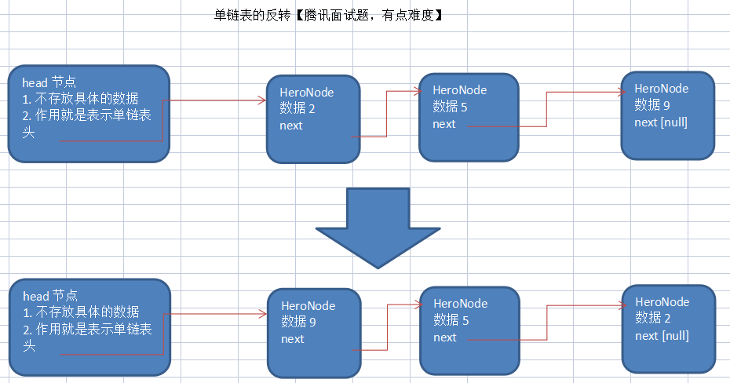

思路如下：

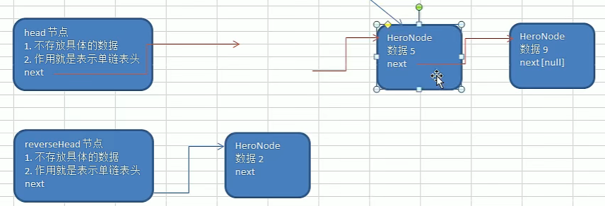

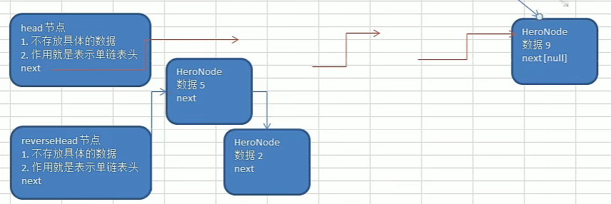

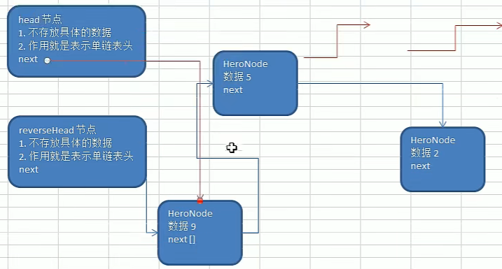

```java
	//将单链表反转
	public static void reversetList(HeroNode head) {
		//如果当前链表为空，或者只有一个节点，无需反转，直接返回
		if(head.next == null || head.next.next == null) {
			return ;
		}

		//定义一个辅助的指针(变量)，帮助我们遍历原来的链表
		HeroNode temp = head.next;
		HeroNode next = null;// 指向当前节点[temp]的下一个节点
		HeroNode reverseHead = new HeroNode(0, "", "");
		//遍历原来的链表，每遍历一个节点，就将其取出，并放在新的链表reverseHead 的最前端
		//动脑筋
		while(true) {
			next = temp.next;//先暂时保存当前节点的下一个节点，因为后面需要使用
			temp.next = reverseHead.next;//将temp的下一个节点指向新的链表的最前端
			reverseHead.next = temp; //将temp 连接到新的链表上
			if (next==null){
				break;
			}
			temp = next;//让temp后移
		}
		//将head.next 指向 reverseHead.next , 实现单链表的反转
		head.next = reverseHead.next;
	}
```

**// 3、从尾到头打印单链表**

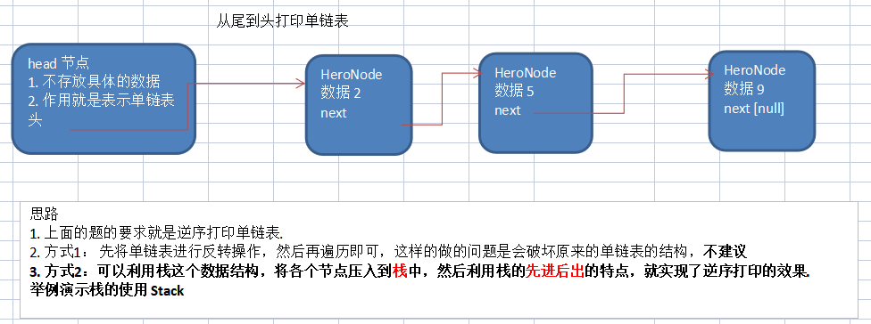

```java
//可以利用栈这个数据结构，将各个节点压入到栈中，然后利用栈的先进后出的特点，就实现了逆序打印的效果
public static void reversePrint(HeroNode head) {
   //空链表，不能打印
   if(head.next == null) {
      return;
   }
   //创建要给一个栈，将各个节点压入栈
   Stack<HeroNode> stack = new Stack<>();
   HeroNode temp = head.next;
   //将链表的所有节点压入栈
   while(true) {
      stack.push(temp);
      if (temp.next==null){//如果为最后一个节点，则break，不再后移
         break;
      }
      temp = temp.next; //temp后移，这样就可以压入下一个节点
   }
   //将栈中的节点进行打印,pop 出栈
   while (stack.size() > 0) {
      System.out.println(stack.pop()); //stack的特点是先进后出
   }
}
```

### 2. 双链表

就是比单向链表多了一个属性，多一个pre域，指向前一个节点。

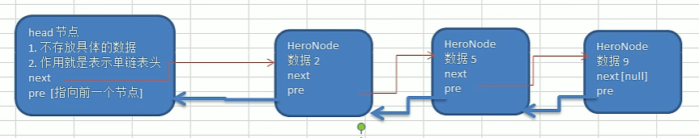

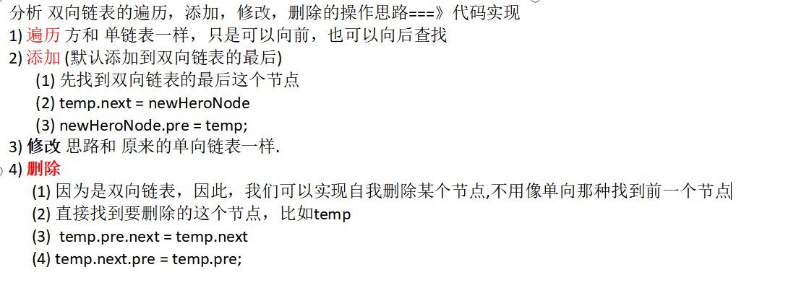

还是用前面的水浒传英雄的例子：

新建对象，加了一个pre对象。

```java
//定义HeroNode2 ， 每个HeroNode 对象就是一个节点
class HeroNode2 {
    public int no;
    public String name;
    public String nickname;
    public HeroNode2 next; //指向下一个节点
    public HeroNode2 pre;
		..............
}
```

**添加节点：**

```java
//添加节点到双向链表
    //思路，当不考虑编号顺序时
    //1. 找到当前链表的最后节点
    //2. 将最后这个节点的next 指向 新的节点，新节点的pre指向这个节点
    public void add(HeroNode2 heroNode2) {

        //因为head节点不能动，因此我们需要一个辅助遍历 temp
        HeroNode2 temp = head;
        //遍历链表，找到最后
        while(true) {
            //找到链表的最后
            if(temp.next == null) {//
                break;
            }
            //如果没有找到最后, 将将temp后移
            temp = temp.next;
        }
        //当退出while循环时，temp就指向了链表的最后
        temp.next = heroNode2;
        heroNode2.pre = temp;
    }
```

**删除节点：**

```java
//删除节点
    //思路：因为是双向的，所以我们直接找到这个被删除节点即可；
    public void del(int no) {
        if (head.next==null){
            return;
        }
        HeroNode2 temp = head.next;
        boolean flag = false; // 标志是否找到待删除节点的
        while(true) {
            if(temp.no == no) {
                //找到的待删除节点的前一个节点temp
                flag = true;
                break;
            }
            if(temp.next == null) { //已经到链表的最后
                break;
            }
            temp = temp.next; //temp后移，遍历
        }
        //判断flag
        if(flag) {
            temp.pre.next = temp.next;
            if (temp.next!=null){
                //这里有问题，当被删除的为最后一个节点时，出现空指针异常；所以必须先判断是不是最后一个
                temp.next.pre = temp.pre;
            }
        }else {
            System.out.printf("要删除的 %d 节点不存在\n", no);
        }
    }
```

**修改节点：**

```java
//修改节点的信息, 根据no编号来修改，即no编号不能改.
    //根据 newHeroNode 的 no 来修改即可
    public void update(HeroNode2 newHeroNode) {
        //判断是否空
        if(head.next == null) {
            System.out.println("链表为空~");
            return;
        }
        //找到需要修改的节点, 根据no编号
        //定义一个辅助变量
        HeroNode2 temp = head.next;
        boolean flag = false; //表示是否找到该节点
        while(true) {
            if(temp.no == newHeroNode.no) {
                //找到
                flag = true;
                break;
            }
            if (temp.next == null) {
                break; //已经遍历完链表
            }
            temp = temp.next;
        }
        //根据flag 判断是否找到要修改的节点
        if(flag) {
            temp.name = newHeroNode.name;
            temp.nickname = newHeroNode.nickname;
        } else { //没有找到
            System.out.printf("没有找到 编号 %d 的节点，不能修改\n", newHeroNode.no);
        }
    }
```

### 3. 单向环形链表

**问题描述：**

Josephu(约瑟夫、约瑟夫环)  问题

设编号为1，2，… n的n个人围坐一圈，约定编号为k（1<=k<=n）的人从1开始报数，数到m 的那个人出列，它的下一位又从1开始报数，数到m的那个人又出列，依次类推，直到所有人出列为止，由此产生一个出队编号的序列。

**思路：**

用一个不带头结点的单向循环链表来处理Josephu 问题：先构成一个有n个结点的单循环链表，然后由k结点起从1开始计数，计到m时，对应结点从链表中删除，然后再从被删除结点的下一个结点又从1开始计数，直到最后一个结点从链表中删除算法结束。

这种就是不带头节点的链表。

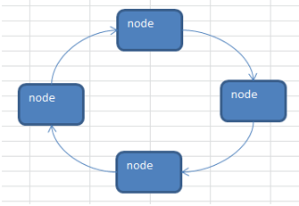

**我们简单写一个例子分析：**

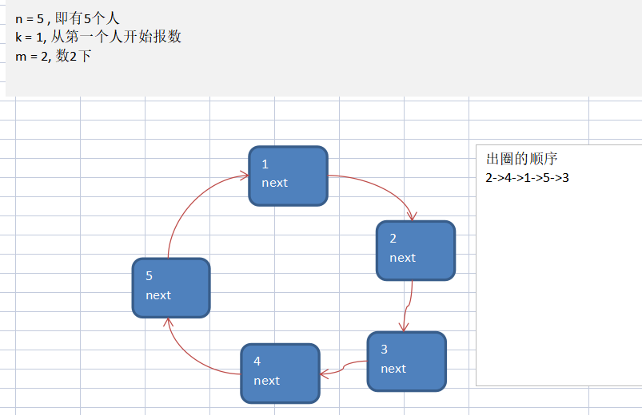

具体单向环形链表实现思路：

1、添加第一个节点时，first是固定指向的，类似于头节点不要乱动。必须让第一个节点自己指向自己。

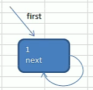

2、添加后续节点时，新建一个辅助指针---curBoy，指向first这里；然后curBoy的next指向新节点boy，新节点boy的next指向first这里；最后curBoy = curBoy.next；；boy不是均是指的要加进来的新节点撒。

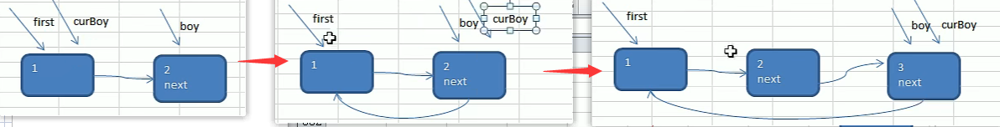

3、遍历环形链表

1. 先让一个辅助指针(变量) curBoy，指向first节点
2.  然后通过一个while循环遍历 该环形链表即可 curBoy.next  == first 结束

**代码实现：**

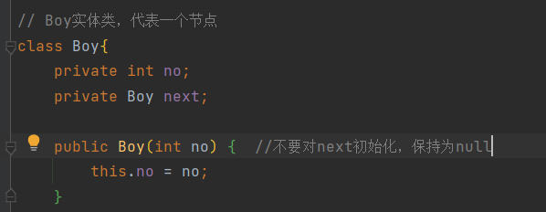

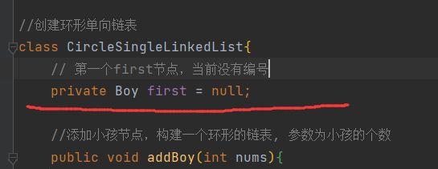

**创建对应的链表：**

```java
//创建环形单向链表
class CircleSingleLinkedList{
  
    // 第一个first节点，当前没有编号
    private Boy first = null;

    //添加小孩节点，构建一个环形的链表, 参数为小孩的个数
    public void addBoy(int nums){
        //数据检验，至少有一个小孩
        if (nums < 1){
            System.out.println("nums的数值错误");
        }
        Boy curBoy = null;  //辅助指针
        // 使用for循环创建环形链表
        for (int i = 1; i <= nums; i++) {
            //根据编号创建小孩节点（从1开始编号）
            Boy boy = new Boy(i);
            //如果是第一个小孩
            if (i==1){
                first = boy;
                first.setNext(first);
                curBoy = first;
            }else {
                // 后续小孩
                curBoy.setNext(boy);
                boy.setNext(first);
                curBoy = curBoy.getNext();
            }
        }
    }

}
```

**遍历：**

```java
//    遍历链表
    public void showBoy(){
        if (first==null){
            System.out.println("链表为空");
            return;
        }
        //因为first不能动，所以需要辅助指针
        Boy temp = first;
        while (true){
            System.out.println("小孩编号为："+temp.getNo());
            if (temp.getNext()==first){
                break;
            }
            temp = temp.getNext();
        }
    }
```

**出圈的顺序：**

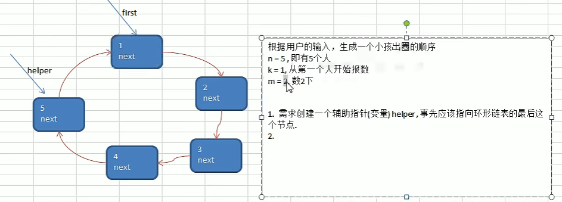

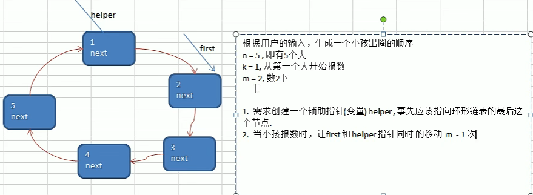

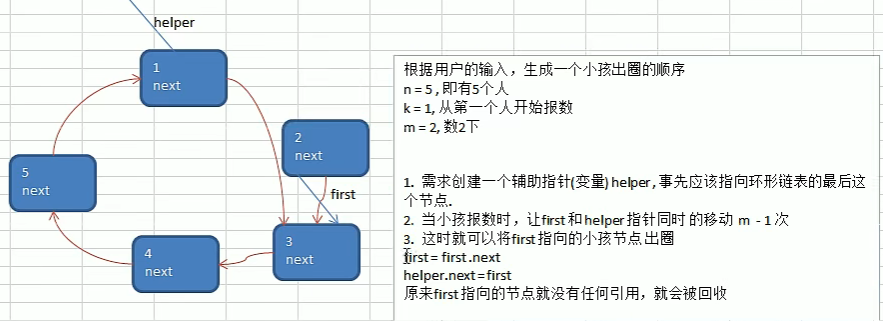

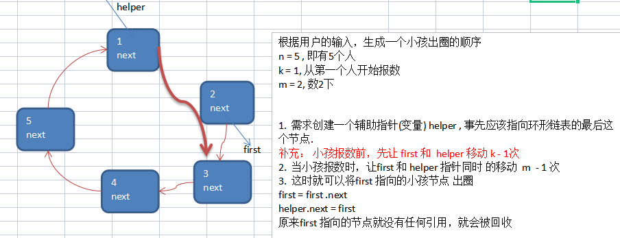

写在`class CircleSingleLinkedList`内部方法

```java
/**
 * 根据用户的输出，计算出圈的顺序
 * @param startNo  表示从第几个小孩开始数--k
 * @param countNum  表示数几下--m
 * @param nums  表示最初有多少个小孩--n
 */
public void countBoy(int startNo, int countNum, int nums){
    // 数据校验
    if (first==null||startNo<1||startNo>nums){
        System.out.println("数据不合理");
        return;
    }
  
    // 创建辅助指针,让他指向最后一个节点
    Boy hepler = first;
    while (true){
        if (hepler.getNext()==first){
            break;
        }
        hepler = hepler.getNext();
    }
  
    // 小孩报数前，先让 first 和  helper 移动 k - 1次
    for (int j=0;j<startNo-1;j++){
        first = first.getNext();
        hepler = hepler.getNext();
    }
  
    // 当小孩报数时，让first 和 helper 指针同时 的移动m-1 次,然后出圈
    while (true) {
        //只剩下一个小孩时，break；不然陷入死循环
        if (hepler==first){
            break;
        }
        //让first 和 helper 指针同时 的移动m-1 次
        for (int j =0; j<countNum-1;j++){
            first = first.getNext();
            hepler = hepler.getNext();
        }
        // 此时first指向的节点就是要出圈的小孩
        System.out.println("小孩出圈的编号为："+first.getNo());
        first = first.getNext();
        hepler.setNext(first);
    }
    System.out.println("最后留在圈里面的小孩编号为："+first.getNo());
}
```

## 4、栈

**简介：**

1. 栈的英文为(stack)
2. 栈是一个**先入后出** (FILO-First In Last Out) 的**有序列表**。
3. 栈(stack)是限制线性表中元素的插入和删除只能在线性表的同一端进行的一种特殊线性表。允许插入和删除的一端，为变化的一端，称为**栈顶(Top)**，另一端为固定的一端，称为**栈底(Bottom)。**
4. 根据栈的定义可知，最先放入栈中元素在栈底，最后放入的元素在栈顶，而删除元素刚好相反，最后放入的元素最先删除，最先放入的元素最后删除

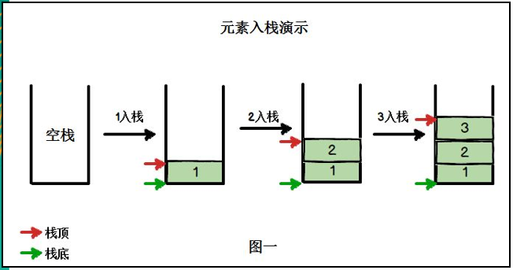

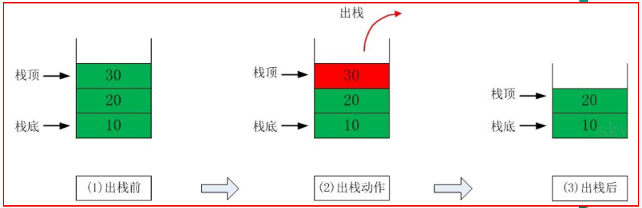

**栈的应用场景：**

- 子程序的调用：在跳往子程序前，会先将下个指令的地址存到堆栈中，直到子程序执行完后再将地址取出，以回到原来的程序中。 	
- 处理递归调用：和子程序的调用类似，只是除了储存下一个指令的地址外，也将参数、区域变量等数据存入堆栈中。
- 表达式的转换 **[中缀表达式转后缀表达式]** 与求值(实际解决)。
- 二叉树的遍历。
- 图形的深度优先(depth一first)搜索法。

### 1. 数组模拟栈

用数组模拟栈的使用，由于栈是一种有序列表，当然可以使用数组的结构来储存栈的数据内容，下面我们就用数组模拟栈的出栈，入栈等操作。

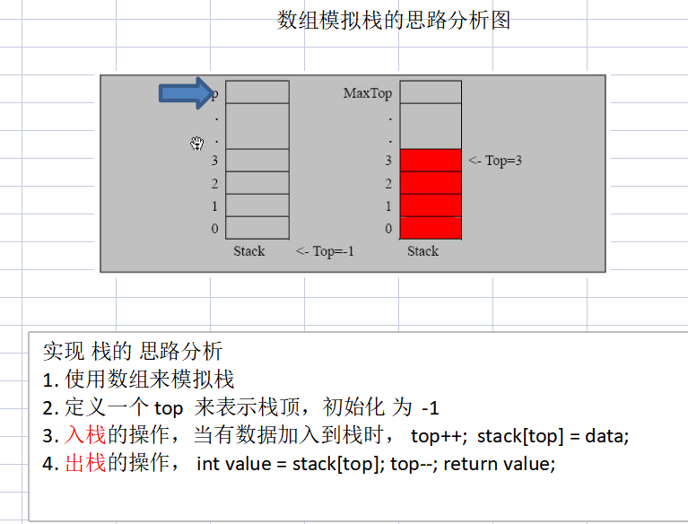

下面两部分代码写在一个java文件里面；

```java
public class ArrayStackDemo {
    public static void main(String[] args) {
        //测试一下ArrayStack 是否正确
        //先创建一个ArrayStack对象->表示栈
        ArrayStack stack = new ArrayStack(4);
        String key = "";
        boolean loop = true; //控制是否退出菜单
        Scanner scanner = new Scanner(System.in);

        while(loop) {
            System.out.println("show: 表示显示栈");
            System.out.println("exit: 退出程序");
            System.out.println("push: 表示添加数据到栈(入栈)");
            System.out.println("pop: 表示从栈取出数据(出栈)");
            System.out.println("请输入你的选择");
            key = scanner.next();
            switch (key) {
                case "show":
                    stack.list();
                    break;
                case "push":
                    System.out.println("请输入一个数");
                    int value = scanner.nextInt();
                    stack.push(value);
                    break;
                case "pop":
                    try {
                        int res = stack.pop();
                        System.out.printf("出栈的数据是 %d\n", res);
                    } catch (Exception e) {
                        // TODO: handle exception
                        System.out.println(e.getMessage());
                    }
                    break;
                case "exit":
                    scanner.close();
                    loop = false;
                    break;
                default:
                    break;
            }
        }

        System.out.println("程序退出~~~");
    }
}
```

```java
// 定义一个ArrayStack，表示栈
class ArrayStack{
    private int maxSize;  // 栈的大小
    private int[] stack; //数组模拟栈，数据放在这个数组
    private int top = -1;  //top——栈顶，初始化-1

    // 构造器
    public ArrayStack(int maxSize) {
        this.maxSize = maxSize;
        stack = new int[maxSize];
    }

//    栈满了
    public boolean isFull(){
        return top==maxSize-1;
    }
//    栈空
    public boolean isEmpty(){
        return top==-1;
    }
//    入栈-push
    public void push(int value){
        // 判断栈满
        if (isFull()){
            System.out.println("栈满");

            return;
        }
        top++;
        stack[top] = value;
    }
//    出栈--pop
    public int pop(){
        if (isEmpty()){
            throw new RuntimeException("栈空");
        }
        int value = stack[top];
        top--;
        return value;
    }
//    遍历栈--从栈顶往下遍历哦，按着出栈的顺序
    public void list(){
        if (isEmpty()){
            System.out.println("栈空");
            return;
        }
        for (int i = top; i>=0;i--){
            System.out.printf("stack[%d] = %d\n",i,stack[i]);
        }
    }
}
```

### 2. 栈实现计算器

思路如下：

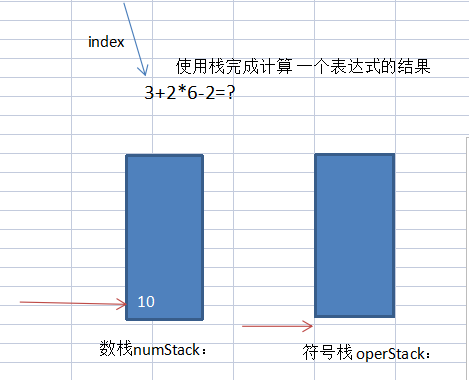

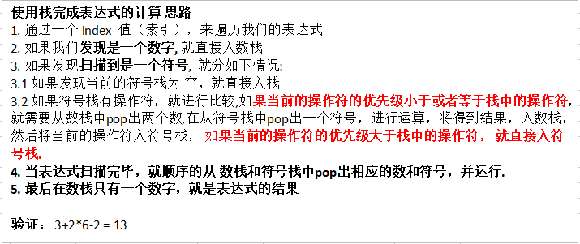

这里具体计算的时候，是后出栈的那个数写在运算的前面哦！！！！！

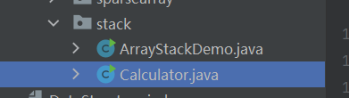

## 5、递归

简单的说: 递归就是方法自己调用自己,每次调用时传入不同的变量.递归有助于编程者解决复杂的问题,同时可以让代码变得简洁。

首先我们先理解递归方法在java内存内部的调用：

最左边的区域是：栈空间。

1、压栈到递归的末尾

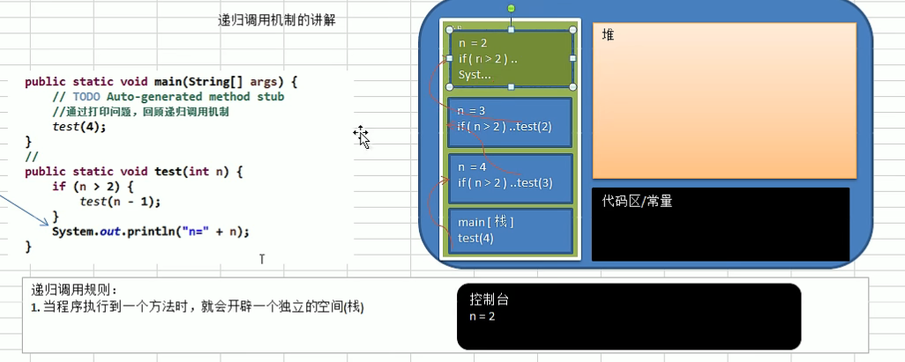

2、再一个个进行出栈

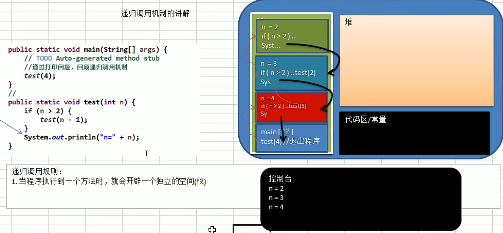

```
递归调用规则：
1. 当程序执行到一个方法时，就会开辟一个独立的空间(栈)
2. 每个空间的数据(局部变量)，是独立的.
```

**递归用于解决什么样的问题**

- 各种数学问题如: 8皇后问题 , 汉诺塔, 阶乘问题, 迷宫问题, 球和篮子的问题(google编程大赛)
- 各种算法中也会使用到递归，比如快排，归并排序，二分查找，分治算法等.
- 将用栈解决的问题-->递归代码比较简洁

**递归需要遵守的重要规则**

1. 执行一个方法时，就创建一个新的受保护的独立空间(栈空间)
2. 方法的局部变量是独立的，不会相互影响, 比如n变量
3. 如果方法中使用的是引用类型变量(比如数组)，就会共享该引用类型的数据.
4. 递归必须向退出递归的条件逼近，否则就是无限递归,出现StackOverflowError，死龟了:)
5. 当一个方法执行完毕，或者遇到return，就会返回，遵守谁调用，就将结果返回给谁，同时当方法执行完毕或者返回时，该方法也就执行完毕。

### 1.迷宫问题

红色的方格为墙，不能走，

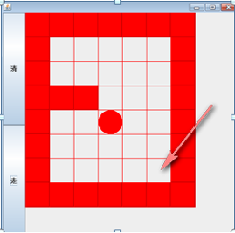

说明: 

- 小球得到的路径，和程序员设置的找路策略有关即：找路的上下左右的顺序相关
- 再得到小球路径时，可以先使用(下右上左)，再改成(上右下左)，看看路径是不是有变化
- 测试回溯现象
- 思考: 如何求出最短路径? 


